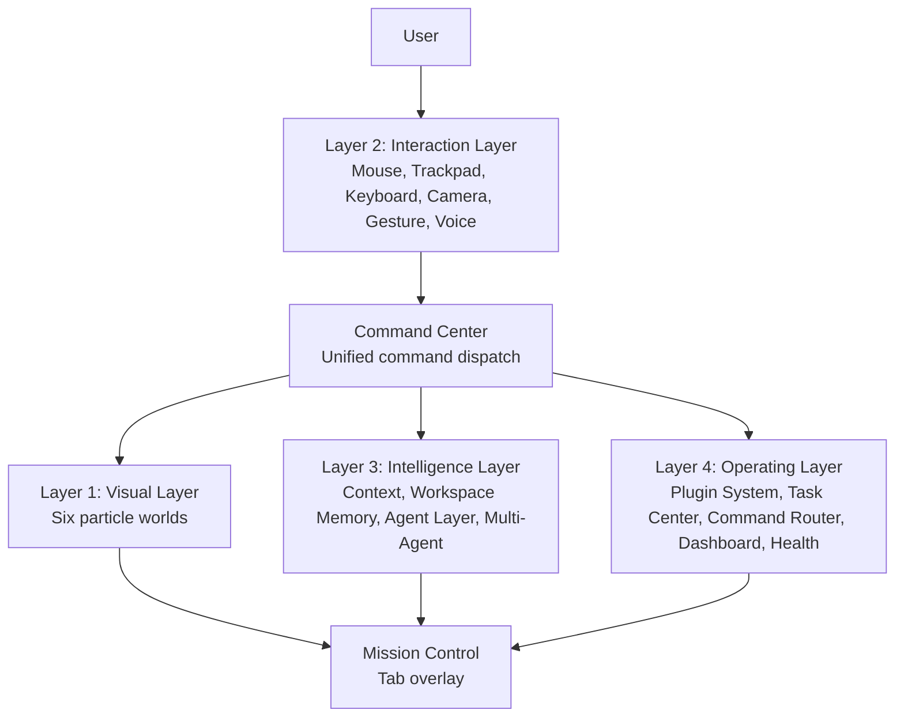
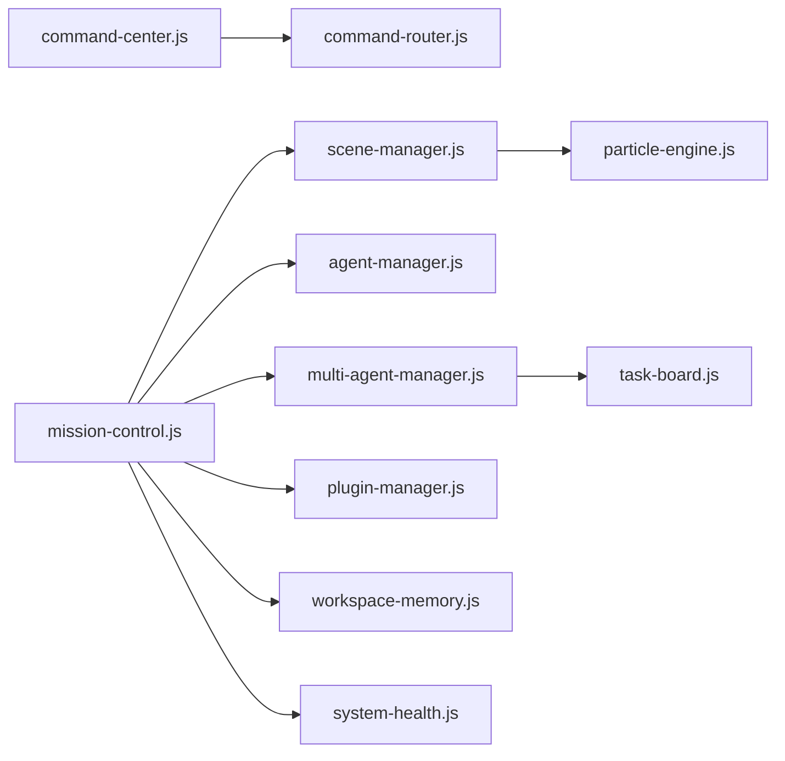
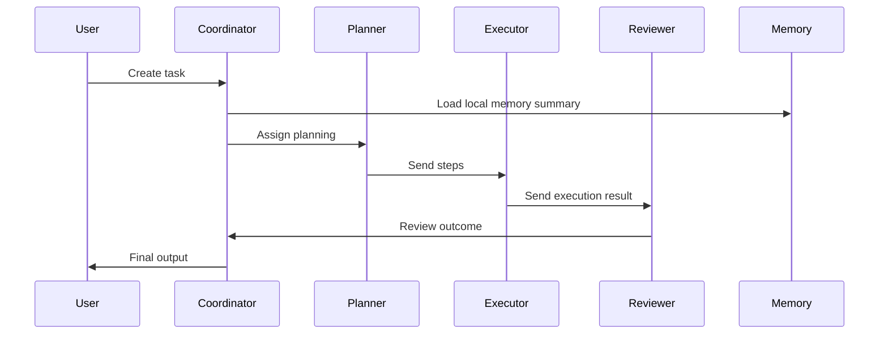
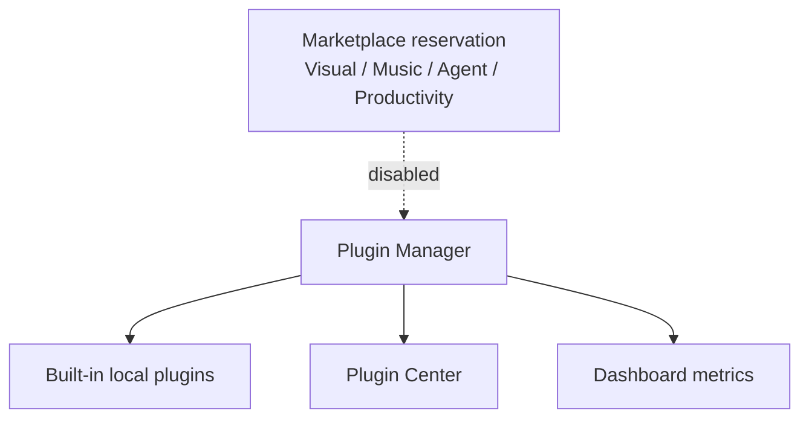
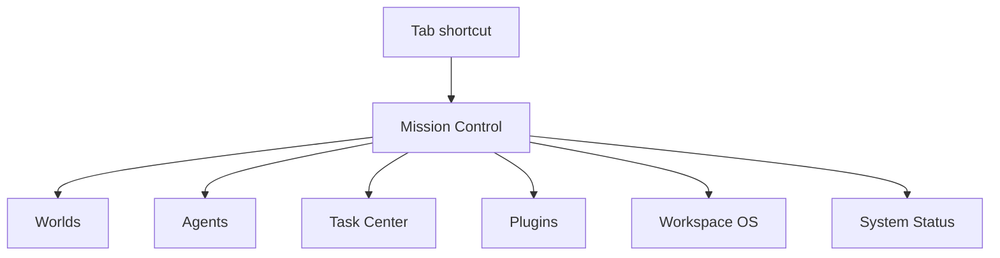

# PMOS Architecture

Particle Multiverse OS V10 is the final consolidation release. It keeps V1-V9 features and organizes them into four product layers.

## Layer 1: Visual Layer

- AI World Tree
- Black Hole Universe
- ARC Reactor
- Neural Brain
- Tesseract
- Ultimate

The Ultimate world now renders a central core with Worlds, Agent, Memory, Task, Plugin, and Voice orbits.

## Layer 2: Interaction Layer

- Mouse and trackpad particle controls
- Keyboard shortcuts
- Camera and gesture control
- Voice Commander

All system commands route through Command Center into the existing Command Router.

## Layer 3: Intelligence Layer

- Context Engine
- Workspace Memory
- Agent Layer
- Multi-Agent System

Workspace Memory remains local-only and includes Study, Coding, Research, Music, Night, and custom workspaces.

## Layer 4: Operating Layer

- Plugin System
- Task Center
- Command Router
- System Command Center Dashboard
- System Health Pro

Mission Control reads from this layer and shows all worlds, agents, tasks, plugins, workspaces, and system status.

## Module Relationship

## Agent Flow

## Plugin Architecture

The V10 marketplace is an architecture reservation only. Online installation is disabled.

## Mission Control Architecture

