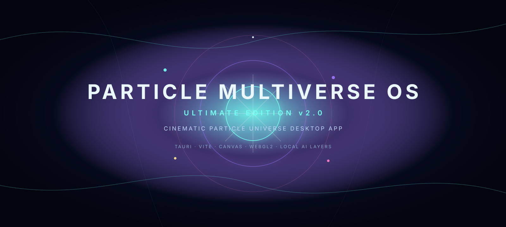
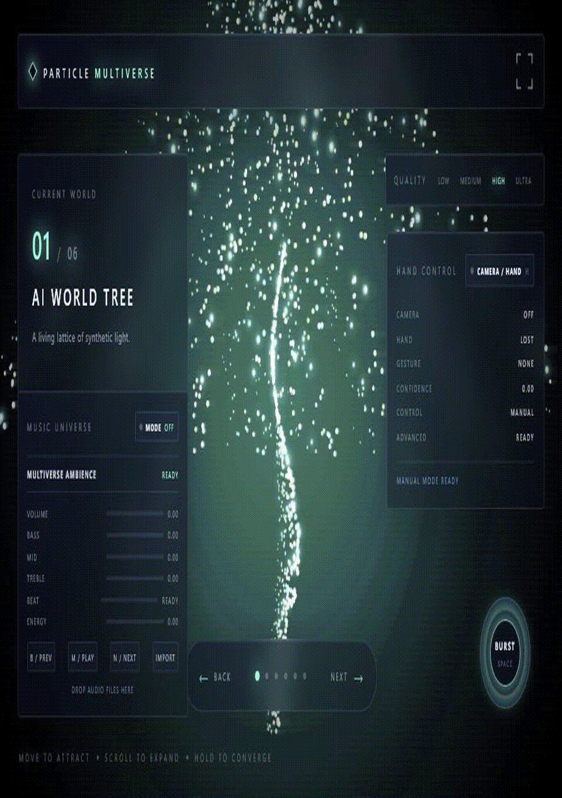
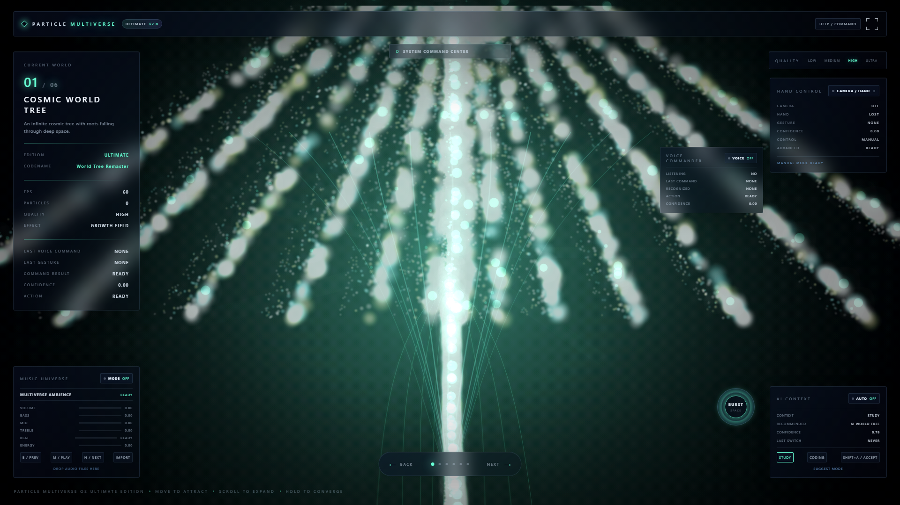
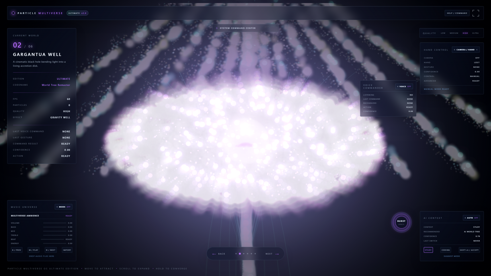
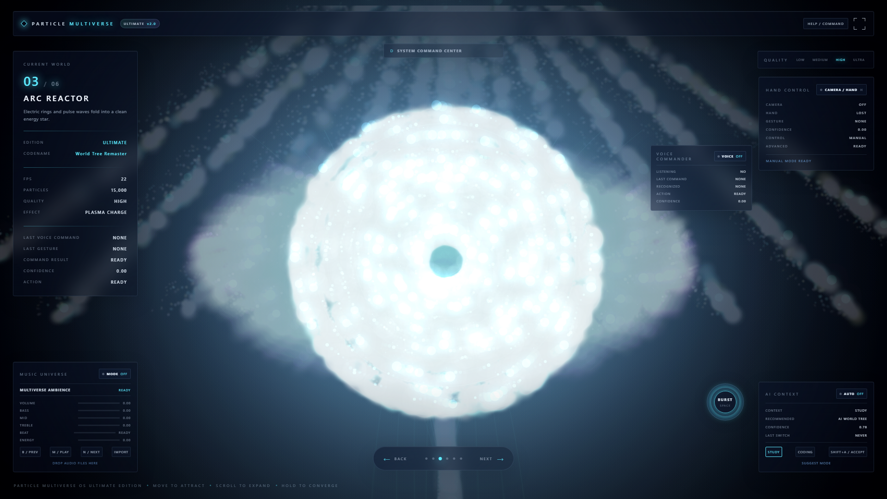
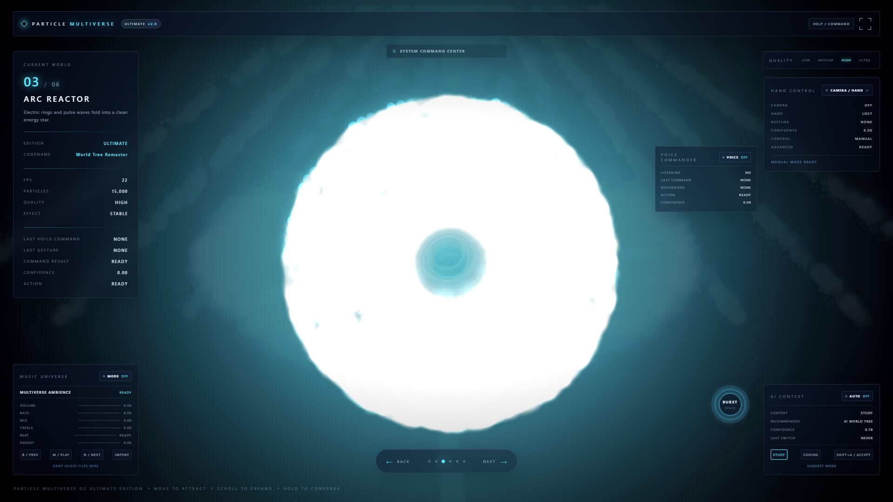
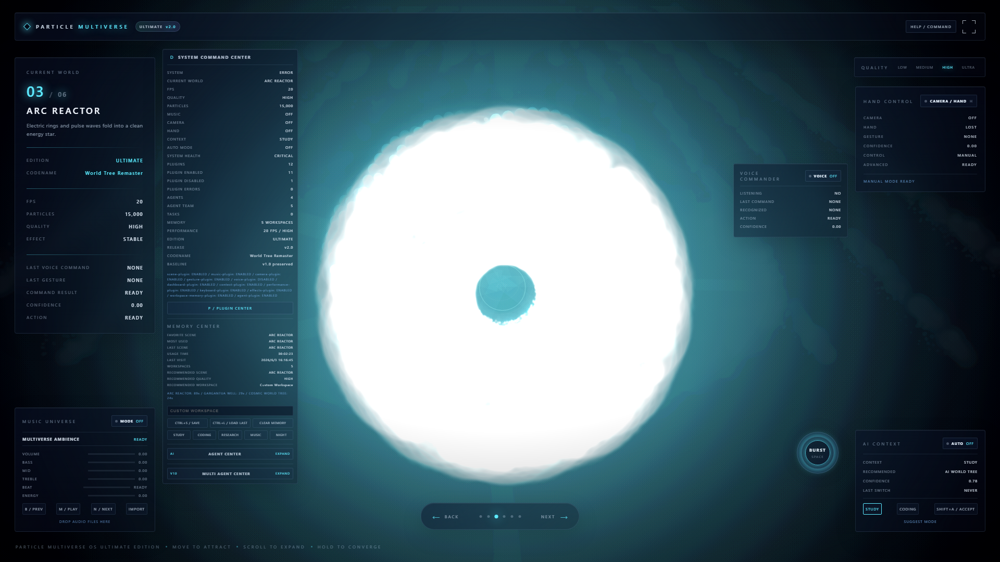
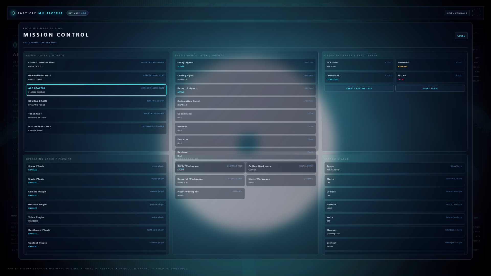

<p align="center">
  
</p>

<h1 align="center">Particle Multiverse OS Ultimate Edition</h1>

<p align="center">
  <strong>Cinematic particle system · Cyberpunk AI interface · Tauri desktop app · Creative coding portfolio project</strong>
</p>

<p align="center">
  <a href="https://github.com/b15018232559-beep/Particle-Multiverse-OS/releases"></a>
  <a href="https://github.com/b15018232559-beep/Particle-Multiverse-OS/releases/tag/v2.0"></a>
  <a href="LICENSE"></a>
  
</p>

<p align="center">
  <a href="#overview">Overview</a>
  ·
  <a href="#showcase">Showcase</a>
  ·
  <a href="#features">Features</a>
  ·
  <a href="#download--release">Download</a>
  ·
  <a href="#install">Install</a>
  ·
  <a href="#roadmap">Roadmap</a>
</p>

---

## Overview

**Particle Multiverse OS** is a cinematic desktop experience built around six reactive particle universes. It combines particle-system rendering, cyberpunk visual design, AI-style interface layers, local voice and gesture controls, workspace memory, plugins, agents, and Mission Control into a polished Windows desktop app.

The project is designed as an open-source portfolio piece: visually strong, easy to run, easy to explain, and easy to share.

> `v1.0` is protected. Ultimate Edition work lives on `develop` and is released as `v2.0`.

## Showcase

### Dynamic GIF

<p align="center">
  
</p>

### High-Resolution Product Screenshots

<table>
  <tr>
    <td width="50%"></td>
    <td width="50%"></td>
  </tr>
  <tr>
    <td align="center"><strong>Home / AI World Tree</strong></td>
    <td align="center"><strong>Black Hole Universe</strong></td>
  </tr>
  <tr>
    <td width="50%"></td>
    <td width="50%"></td>
  </tr>
  <tr>
    <td align="center"><strong>ARC Reactor</strong></td>
    <td align="center"><strong>Particle Burst Interaction</strong></td>
  </tr>
  <tr>
    <td width="50%"></td>
    <td width="50%"></td>
  </tr>
  <tr>
    <td align="center"><strong>System Command Center</strong></td>
    <td align="center"><strong>Mission Control</strong></td>
  </tr>
</table>

## Features

- **Six cinematic particle worlds** with distinct colors, motion models, and interactions.
- **Shockwave burst system** triggered by Space, double click, UI control, or voice command.
- **Canvas/WebGL-style visual effects** with glow, depth layers, fog, trails, and cinematic atmosphere.
- **Ultimate Edition UI identity** across HUD, Dashboard, Mission Control, and desktop metadata.
- **Local voice commands** in Chinese and English.
- **Camera and hand gesture layer** using local MediaPipe processing.
- **Music reactive universe mode** through local audio import and Web Audio analysis.
- **Workspace Memory** for local snapshots, preferences, and scene history.
- **Agent Layer and Multi-Agent System** with local task board and discussion flow.
- **Plugin Center** with real enable/disable controls and isolated plugin errors.
- **Tauri desktop release pipeline** with Windows installer and portable executable.

## Tech Stack

<p align="center">
  
</p>

| Layer | Stack |
| --- | --- |
| Desktop runtime | Tauri 2 |
| Frontend | HTML, CSS, JavaScript ES Modules |
| Build tool | Vite |
| Rendering | Canvas 2D, WebGL2-style instancing path |
| Vision | MediaPipe Tasks Vision |
| Audio | Web Audio API |
| Storage | Local Workspace Memory |
| Packaging | Tauri NSIS Windows installer |

## Download / Release

Latest release:

```text
https://github.com/b15018232559-beep/Particle-Multiverse-OS/releases
```

Release assets:

- `Particle-Multiverse-OS-Setup.exe`
- `Particle-Multiverse-OS-Portable.exe`
- `release/GITHUB_RELEASE_v2.0.md`
- `release/GITHUB_RELEASE_v1.1.md`

Protected baseline:

- `v1.0` keeps the original portfolio release.
- `v1.1` adds generated high-resolution product screenshots and README presentation updates.
- `v2.0` is the Ultimate Edition release line.

## Install

### Run From Source

```bash
git clone git@github.com:b15018232559-beep/Particle-Multiverse-OS.git
cd Particle-Multiverse-OS
npm install
npm run dev
```

Open:

```text
http://localhost:1420
```

### Desktop Development

```bash
npm run tauri dev
```

### Build Desktop Release

```bash
npm run build
npm run tauri build
```

The desktop installer is generated under:

```text
src-tauri/target/release/bundle/nsis/
```

## Recommended GitHub Topics

Add these topics in GitHub repository settings:

```text
particle-system
tauri
desktop-app
ai-interface
creative-coding
cyberpunk
visual-effects
javascript
vite
```

## Roadmap

- [x] v1.0: Protected cinematic particle desktop release.
- [x] v1.1: High-resolution product screenshots and README documentation refresh.
- [x] v2.0: Ultimate Edition identity, presentation, and release metadata.
- [x] Portfolio README: Hero banner, screenshots, GIF, roadmap, release links, and Star History.
- [ ] v2.1: World Tree Remaster visual pass.
- [ ] v2.2: Fresh release video and signed installer workflow.
- [ ] v2.3: Documentation site and architecture diagrams.
- [ ] v3.0: Cross-platform packaging audit.

## Portfolio Materials

- [Project Showcase](PROJECT_SHOWCASE.md)
- [GitHub Profile Guide](GITHUB_PROFILE_GUIDE.md)
- [Promotion Plan](PROMOTION_PLAN.md)

## Star History

<a href="https://www.star-history.com/#b15018232559-beep/Particle-Multiverse-OS&Date">
  <picture>
    <source media="(prefers-color-scheme: dark)" srcset="https://api.star-history.com/svg?repos=b15018232559-beep/Particle-Multiverse-OS&type=Date&theme=dark" />
    <source media="(prefers-color-scheme: light)" srcset="https://api.star-history.com/svg?repos=b15018232559-beep/Particle-Multiverse-OS&type=Date" />
    
  </picture>
</a>

## License

Released under the [MIT License](LICENSE).
