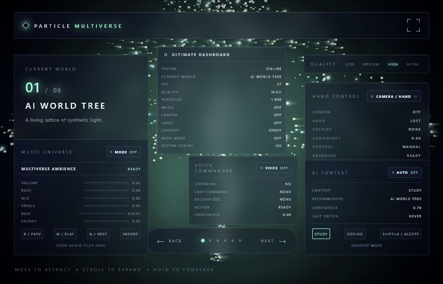

# Particle Multiverse OS Ultimate Edition

**Particle Multiverse OS Ultimate Edition** is a cinematic desktop particle universe built with Canvas/WebGL, Vite, and Tauri. It preserves the full v1.0 release and adds a v2.0 Ultimate Edition operating identity for the World Tree Remaster development line.

The protected v1.0 release remains tagged at `v1.0`. Ultimate Edition work is developed on `develop` and released as `v2.0`.



## Project Overview

Particle Multiverse OS started as an interactive particle desktop app and evolved into a cinematic sci-fi operating layer. The final build focuses on visual impact, spatial depth, and local interaction without cloud services or private-data collection.

The app contains six particle worlds:

- **Cosmic World Tree**: an infinite root and branch structure with flowing energy.
- **Gargantua Well**: a black-hole universe with accretion-disk motion and lensing-style light.
- **ARC Reactor**: a reactor core with plasma rings, pulse waves, and electric arcs.
- **Neural Brain**: an electric cortex with signal propagation and neural links.
- **Tesseract**: a rotating hypercube with dimensional folding.
- **Multiverse Core**: five worlds orbiting a central universe core.

## Feature Showcase

- Ultimate Edition identity layer with v2.0 release metadata across HUD, Dashboard, and Mission Control.
- Preserved v1.0 baseline: six worlds, particles, fullscreen, Tauri desktop build, release assets, and local-first privacy.
- Cinematic particle renderer with LOW/MEDIUM/HIGH/ULTRA density presets.
- Particle density up to **30,000** particles on ULTRA.
- Optional WebGL2 instanced particle layer with Canvas fallback.
- Near, Mid, and Far particle depth layers for spatial parallax.
- Bloom, HDR glow, volumetric fog, god-ray style shafts, and particle trails.
- Smooth world switching with Next, Back, arrows, and gesture swipes.
- Shockwave burst via Space, double click, voice, or Burst control.
- Local voice commands in Chinese and English.
- Stable hand gestures: open hand, fist, point, swipe, pinch, double open, double fist.
- Music-reactive particle effects with local audio import.
- AI Context, Dashboard, Plugin Center, Workspace Memory, Agent Layer, Multi-Agent task board, and Mission Control.
- Cinematic Mode through F11/fullscreen, hiding UI for recording and presentation.
- Tauri Windows desktop build with installer and portable executable.

## Screenshots

Screenshots and preview images are stored in [`screenshots/`](screenshots/).

| Preview | File |
| --- | --- |
| V2 camera/gesture preview | `screenshots/Particle-Multiverse-OS-V2-preview.png` |
| V3 music universe preview | `screenshots/Particle-Multiverse-OS-V3-preview.png` |
| V4 context preview | `screenshots/Particle-Multiverse-OS-V4-preview.png` |
| V5 dashboard/voice preview | `screenshots/Particle-Multiverse-OS-V5-preview.png` |

## Tech Stack

- **Frontend**: HTML, CSS, JavaScript ES Modules
- **Renderer**: Canvas 2D, optional WebGL2 instanced particle layer
- **Build Tool**: Vite
- **Desktop Runtime**: Tauri 2
- **Vision**: MediaPipe Tasks Vision
- **Audio**: Web Audio API
- **Storage**: local browser storage through Workspace Memory
- **Packaging**: Tauri NSIS Windows installer

## Installation

### Download Release Build

Use the files in [`release/`](release/):

- `Particle-Multiverse-OS-Setup.exe`
- `Particle-Multiverse-OS-Portable.exe`

Run the setup installer for a normal Windows installation, or run the portable executable directly.

### Run From Source

```bash
npm install
npm run dev
```

Open:

```text
http://localhost:1420
```

### Run Desktop Dev Build

```bash
npm run tauri dev
```

### Build Desktop Release

```bash
npm run tauri build
```

The generated Tauri installer is created under:

```text
src-tauri/target/release/bundle/nsis/
```

## Controls

| Input | Action |
| --- | --- |
| Mouse / touchpad | Attract and interact with particles |
| Wheel | Expand particles |
| Double click | Burst |
| Long press | Converge particles |
| Space | Shockwave burst |
| Back / Next / arrows | Switch worlds |
| F11 | Fullscreen Cinematic Mode |
| Esc | Exit fullscreen or close overlays |
| D | Toggle Dashboard |
| P | Toggle Plugin Center |
| V | Toggle Voice Commander |
| ? | Toggle Command Help |
| Tab | Toggle Mission Control |

## Voice Commands

Examples:

- Chinese: `下一页`, `上一页`, `进入黑洞`, `粒子爆发`, `播放音乐`, `打开仪表盘`, `显示指令`
- English: `next`, `back`, `black hole`, `burst`, `play music`, `open dashboard`, `show commands`

See [`COMMAND_GUIDE.md`](COMMAND_GUIDE.md) for the full command list.

## Release v2.0

Ultimate Edition release assets and draft notes are prepared in [`release/`](release/):

```text
release/GITHUB_RELEASE_v2.0.md
```

The protected v1.0 Git tag is preserved and should not be rewritten.

## Release v1.0

Release assets are prepared in [`release/`](release/). The GitHub Release draft is available at:

```text
release/GITHUB_RELEASE_v1.0.md
```

## Privacy

Particle Multiverse OS is local-first:

- No private-file scanning.
- No browser-history scanning.
- No cloud upload.
- Camera and microphone are opt-in and only used for local interaction features.

## License

This project is released under the MIT License. See [`LICENSE`](LICENSE).
