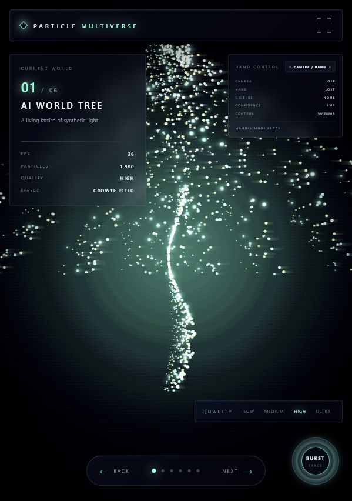
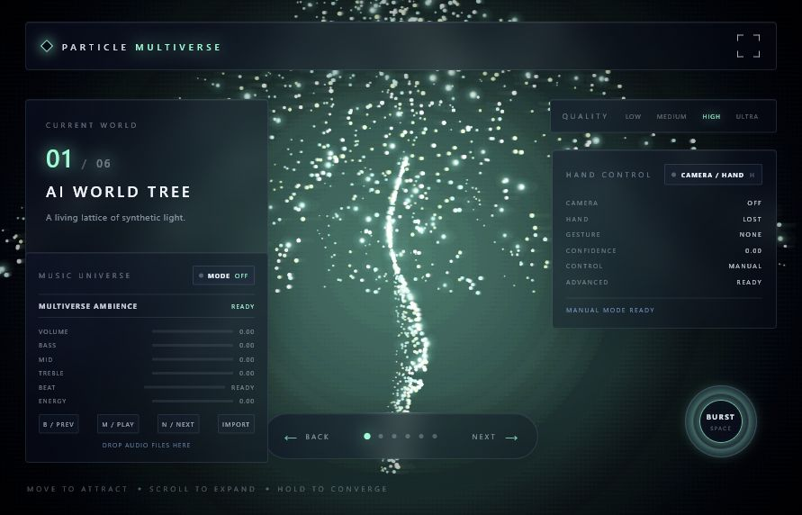
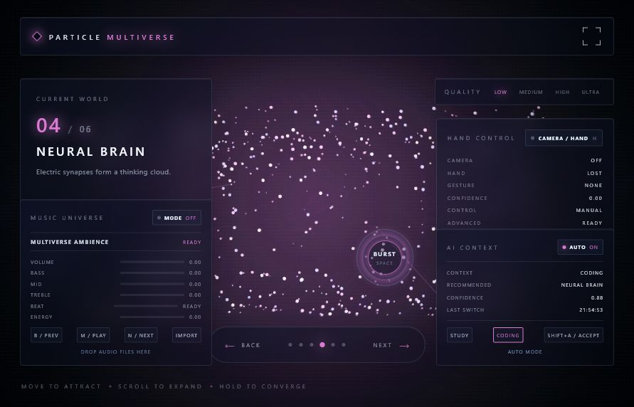

<p align="center">
  
</p>

<h1 align="center">Particle Multiverse OS</h1>

<p align="center">
  <strong>A cinematic particle multiverse desktop app for Windows, built with Tauri, Vite, Canvas, and WebGL2.</strong>
</p>

<p align="center">
  <a href="https://github.com/b15018232559-beep/Particle-Multiverse-OS/releases/tag/v2.0"></a>
  <a href="LICENSE"></a>
  
  
</p>

<p align="center">
  <a href="#showcase">Showcase</a>
  ·
  <a href="#features">Features</a>
  ·
  <a href="#install">Install</a>
  ·
  <a href="#tech-stack">Tech Stack</a>
  ·
  <a href="#roadmap">Roadmap</a>
</p>

---

## Overview

**Particle Multiverse OS Ultimate Edition** is a sci-fi desktop visual system centered on six reactive particle worlds, cinematic glow, local interaction, workspace memory, agent layers, plugin control, and Mission Control.

It is designed as a GitHub portfolio-grade open-source project: high-impact visuals first, no fake buttons, local-first privacy, and a real Tauri desktop release pipeline.

> `v1.0` is protected and preserved. Ultimate Edition development happens on `develop` and is released as `v2.0`.

## Showcase

### Dynamic Demo

<p align="center">
  
</p>

### Screenshots

<table>
  <tr>
    <td width="50%"></td>
    <td width="50%"></td>
  </tr>
  <tr>
    <td align="center"><strong>Camera + Gesture Layer</strong></td>
    <td align="center"><strong>Music Reactive Universe</strong></td>
  </tr>
  <tr>
    <td width="50%"></td>
    <td width="50%"></td>
  </tr>
  <tr>
    <td align="center"><strong>AI Context Engine</strong></td>
    <td align="center"><strong>Dashboard + Voice Commander</strong></td>
  </tr>
</table>

## Worlds

| World | Visual Identity | Interaction |
| --- | --- | --- |
| Cosmic World Tree | Infinite roots, branches, green-cyan energy | Growth Field |
| Gargantua Well | Black hole, accretion disk, lensing-style light | Gravity Well |
| ARC Reactor | Plasma rings, pulse waves, electric core | Plasma Charge |
| Neural Brain | Electric cortex, neural signal mesh | Synaptic Focus |
| Tesseract | Rotating hypercube, dimensional folding | Dimension Shift |
| Multiverse Core | Five universes orbiting one central core | Reality Warp |

## Features

- **Cinematic particle engine** with LOW, MEDIUM, HIGH, and ULTRA quality modes.
- **Up to 30,000 particles** on ULTRA with depth layers, glow, fog, trails, and bloom.
- **Six complete worlds**, each with distinct color, movement, and interaction behavior.
- **Smooth navigation** through Next, Back, arrows, wheel, touchpad, and gesture swipes.
- **Shockwave burst system** through Space, double click, voice, and Burst control.
- **Ultimate Edition identity layer** across HUD, Dashboard, Mission Control, and desktop metadata.
- **Mission Control** for worlds, agents, plugins, tasks, workspaces, memory, and health.
- **Local voice commands** in Chinese and English.
- **Hand gesture layer** with camera opt-in and local MediaPipe processing.
- **Music reactive mode** with local audio import and Web Audio analysis.
- **Workspace Memory** for local snapshots, scene usage, preferences, and restoration.
- **Agent Layer + Multi-Agent System** with isolated task board, suggestions, and discussion flow.
- **Plugin Center** with real enable/disable controls and error isolation.
- **Tauri desktop packaging** with installer and portable release assets.

## Tech Stack

<p align="center">
  
</p>

| Layer | Technology |
| --- | --- |
| Desktop | Tauri 2 |
| Frontend | HTML, CSS, JavaScript ES Modules |
| Renderer | Canvas 2D, optional WebGL2 instancing |
| Build | Vite |
| Vision | MediaPipe Tasks Vision |
| Audio | Web Audio API |
| Storage | Local browser storage through Workspace Memory |
| Packaging | Tauri NSIS Windows installer |

## Install

### Download Release

Download from GitHub Releases:

- `Particle-Multiverse-OS-Setup.exe`
- `Particle-Multiverse-OS-Portable.exe`

Or use the local release folder:

```text
release/
```

### Run From Source

```bash
git clone git@github.com:b15018232559-beep/Particle-Multiverse-OS.git
cd Particle-Multiverse-OS
npm install
npm run dev
```

Open:

```text
http://localhost:1420
```

### Desktop Development

```bash
npm run tauri dev
```

### Build Desktop Release

```bash
npm run build
npm run tauri build
```

Tauri outputs the installer under:

```text
src-tauri/target/release/bundle/nsis/
```

## Controls

| Input | Action |
| --- | --- |
| Mouse / touchpad | Attract particles |
| Wheel | Expand particle field |
| Double click | Trigger burst |
| Long press | Converge particles |
| Space | Shockwave |
| Arrow keys | Switch worlds |
| F11 | Fullscreen cinematic mode |
| Esc | Exit fullscreen or close overlays |
| D | Dashboard |
| P | Plugin Center |
| V | Voice Commander |
| Tab | Mission Control |

## Roadmap

- [x] v1.0: Protected cinematic particle desktop release.
- [x] v2.0: Ultimate Edition identity layer, release metadata, and GitHub presentation upgrade.
- [ ] v2.1: World Tree Remaster visual pass.
- [ ] v2.2: Release asset refresh with signed installer workflow.
- [ ] v2.3: Documentation site and API-level architecture diagrams.
- [ ] v3.0: Cross-platform packaging audit.

## Project Principles

- No fake buttons.
- No placeholder pages.
- No cloud upload.
- No private-file scanning.
- No browser-history scanning.
- Desktop-first, local-first, visually complete.

## Repository

- Protected release tag: [`v1.0`](https://github.com/b15018232559-beep/Particle-Multiverse-OS/releases/tag/v1.0)
- Ultimate release tag: [`v2.0`](https://github.com/b15018232559-beep/Particle-Multiverse-OS/releases/tag/v2.0)
- Development branch: [`develop`](https://github.com/b15018232559-beep/Particle-Multiverse-OS/tree/develop)
- Release notes: [`release/GITHUB_RELEASE_v2.0.md`](release/GITHUB_RELEASE_v2.0.md)

## Star History

<a href="https://www.star-history.com/#b15018232559-beep/Particle-Multiverse-OS&Date">
  <picture>
    <source media="(prefers-color-scheme: dark)" srcset="https://api.star-history.com/svg?repos=b15018232559-beep/Particle-Multiverse-OS&type=Date&theme=dark" />
    <source media="(prefers-color-scheme: light)" srcset="https://api.star-history.com/svg?repos=b15018232559-beep/Particle-Multiverse-OS&type=Date" />
    
  </picture>
</a>

## License

Released under the [MIT License](LICENSE).
